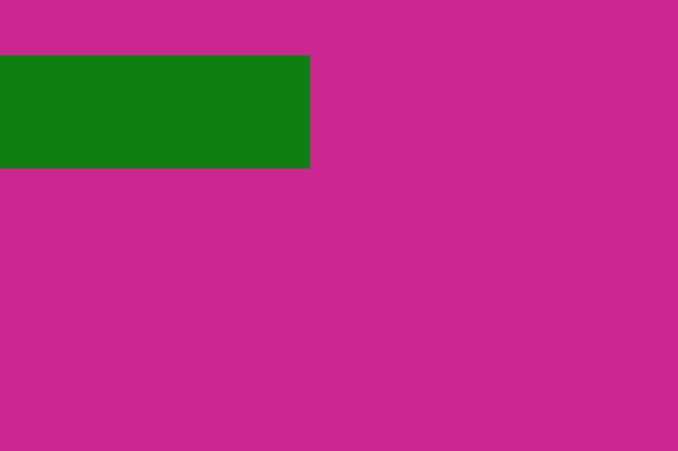
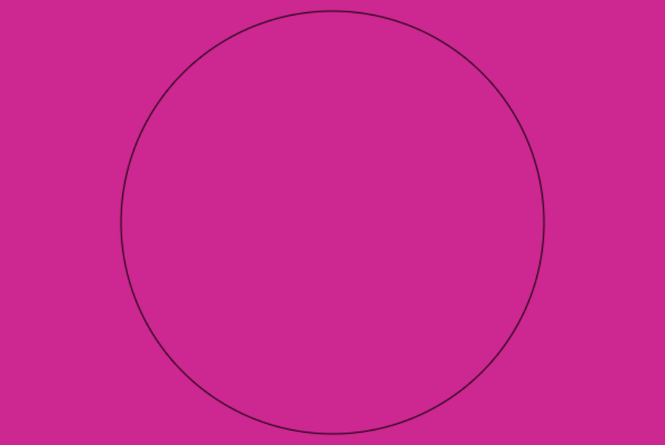
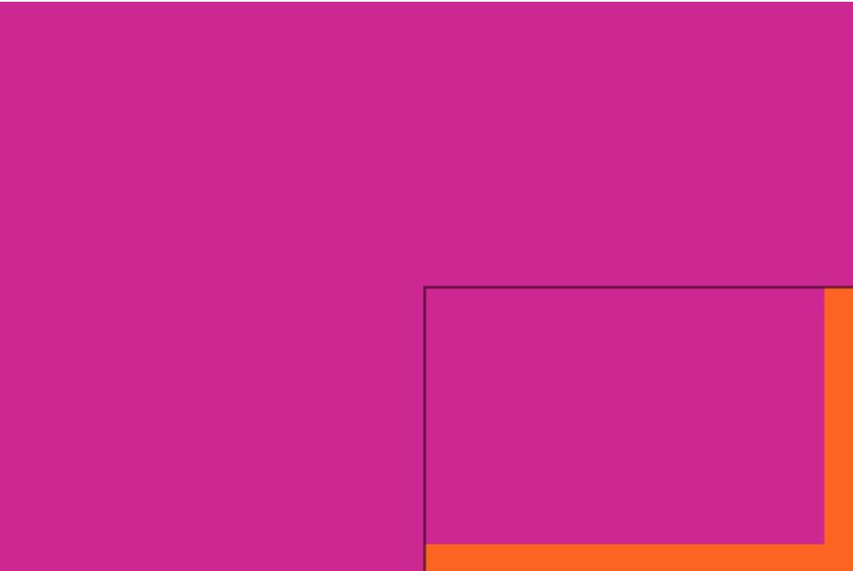
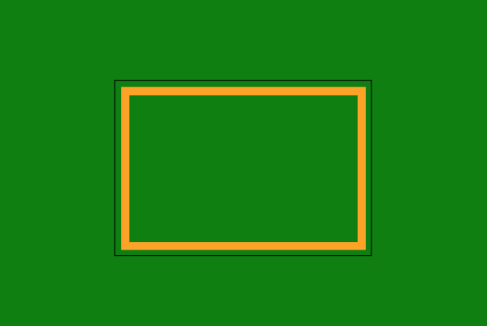

## Dynamic Web 1 Week 7 Instructions

**Mini canvas Project 5 Canvas Drawing Exercises:** counts toward **65%** of the **final grade**

**Week 7 Homework Part 2:** counts toward **65%** of the **final grade**

**Note:** I have included a `week-7-hw-answers.txt` file in **_this repository_** for you to **use** for your **answers** to the **questions** in **part 2** of this **homework**. **_PLEASE USE IT_**.

**IMPORTANT:** **_As with_** the **week 6 homework**, **MAKE SURE** to `git clone` this **repository** to your **_laptop_**, `rm -rf .git`, and **re-initialize Git** with `git init` inside **_this_** `homework folder`. Make sure that **this folder** is a **_separate repository_** and is **not added** to a **_class repository_** you have **created** with a **_whole bunch_** of **homework folders** **_inside it_**.

## Starter Code (already added to files):

```html
<!-- index.html -->
<!DOCTYPE html>
<html lang="en">
  <head>
    <meta charset="UTF-8" />
    <meta name="viewport" content="width=device-width, initial-scale=1.0" />
    <title>Canvas 2d Basics</title>
    <link rel="stylesheet" href="styles/css/main.css" />
  </head>

  <body>
    <div class="wrapper">
      <p class="unsupported"></p>
      <canvas id="canvas" width="600" height="400"></canvas>
    </div>
    <script src="scripts/js/fillRect.js"></script>
  </body>
</html>
```

```js
//scripts/js/circle.js
// empty
// scripts/js/fillRect.js
// empty
// scripts/js/triangle.js
// empty
```

```css
/* styles/css/main.css */
* {
  padding: 0;
  margin: 0;
  box-sizing: border-box;
}

body {
  overflow-x: hidden;
  overflow-y: hidden;
}

.wrapper {
  position: relative;
}

#canvas {
  position: absolute;
  left: 0;
  right: 0;
  top: 50px;
  margin: 0 auto;
  display: flex;
  justify-content: center;
  background: #cf1e92;
}
```

### Drawing Exercise 1:

- Inside your `fillRect.js` file, `declare` and `initialize` a **const variable** called `canvas`. **_Assign_** **it** the **value** `document.getElementById("canvas")`.

- Inside your `fillRect.js` file, `declare` and `initialize` a **let variable** called `ctx` (short for context). **_Assign_** **it** the **value** of `canvas.getContext("2d")`.

- Inside your `fillRect.js file`, set the `.fillStyle` **property** on the `ctx` **variable** (`ctx.fillStyle`). **_Assign_** **it** a **value** of a `hex color`, `gradient`, or **_some other_** **color related** `value`.

- Inside your `fillRect.js` file, set the `.fillRect()` **_built-in_** **method** on `ctx` (`ctx.fillRect()`), and **_pass it_** **four arguments**: 1. `0`, the `x-coordinate` of the **rectangle's** `starting point`, 2. `50`, the `y-coordinate` of the **rectangle's** `starting point`, 3. the `width` of the **rectangle**, and 4. the `height` of the **rectangle**. For the **_width_**, I want you to **select** a `width` that is **_less than_** `300`, and for the `height` of the **rectangle**, I want you to **select** a `height` that is **_less than_** `150`.

- Inside your `main.css` file, add the following to either the `#canvas` (id) or the `canvas` (element):

```css
#canvas {
  background: #cf1e92;
}
```

Choose **_your own_** `background` **property** value. You could also do instead:

```css
#canvas {
  border: 1px solid #000;
}
```

**_for example_**. Basically, you are styling the canvas somehow in your `external stylesheet`. Do **_not_** **add** a `width` or `height` **property** **_here_**.

I have already added some other css to your external stylesheet. It is for some `basic reset`, **_getting rid of_** `body overflow`, and **centering** the `canvas`.

- Make sure to **_check_** your **work** in the **browser** with the `VS Code Liver Server`, if that is the `Code Editor` you are using. In `Brackets`, try using the `Live Preview` **feature**. It should work.

The **visual outcome** of **_this exercise_** should look **something** like **_this_**:



Yours will probably **look** **_different_**, depending on what you **choose** for the `width` and `height` of your `rectangle`!

Play around with this. Have fun! If you have a **_better idea_** using this code as a **_starting point_** (pun intended!), **_show_** **me**. But **_be sure_** to **explain** what is **going on** with the **_code_** and **_why_** you are doing what you are doing! **_Make sure to keep it within the rectangle/fillRect() theme_**. You **_do not_** **have to** **_limit_** **yourself** to what I am presenting to you. If you want to take things a step further, **experiment**. **_Google away_** to find your **answers**. Good **_starting points_** are the **links** I share within the **Related Resources** **_section_** at the end of this `README.md` **file**.

### Drawing Exercise 2:

- **_Remove_** the `fillRect.js` file from the `script` **tag** in `index.html`. **_Replace it_** with your `circle.js` file.

- Next, inside `circle.js`, `declare` and `initialize` a **const variable** called `canvas`. **_Assign_** **it** the **value** of `document.getElementById("canvas")`. Like this:

```js
const canvas = document.getElementById("canvas");
```

- Next, inside `circle.js`, `declare` and `initialize` a **let variable** called `ctx`. **_Assign_** **it** the **value** of `canvas.getContext("2d")`. Like this:

```js
let ctx = canvas.getContext("2d");
```

- Next, inside `circle.js`, set the `.beginPath()` **built-in method** on `ctx`. Like this:

```js
ctx.beginPath();
```

- Next, inside of `circle.js`, `declare` and `initialize` a **const variable** called `centerX`. **_Assign_** **it** the **value** of `canvas.width / 2`. so like this:

```js
const centerX = canvas.width / 2;
```

- Next, inside of `circle.js`, `declare` and `initialize` a **const variable** called `centerY`. **_Assign_** **it** a **value** of `canvas.height / 2`. So like this:

```js
const centerY = canvas.width / 2;
```

And if you want to **_clarify_** for **yourself** the **size** of your `circle`, you can **do** the **_following_** with the **radius**, for example:

```js
const radius = 190;
```

- Next, set the `.arc(x, y, r, startAngle, endAngle)` method on `ctx`. Like this:

```js
ctx.arc(centerX, centerY, radius, 0, Math.PI * 2);
```

- Next, inside `circle.js`, set the `.stroke()` method on `ctx` (`ctx.stroke()`). Like this:

```js
ctx.stroke();
```

- Make sure to **_check_** your **work** in the browser with the `VS Code Liver Server`, if that is the `Code Editor` you are using. In `Brackets`, try using the `Live Preview` **feature**. It should work.

**_Initially_**, your `canvas` for this **exercise** should look like **_this_**:



Play around with this. Have fun! If you have a **_better idea_** using this code as a **_starting point_** (pun intended!), **_show_** **me**. But **_be sure_** to **explain** what is **going on** with the **_code_** and **_why_** you are doing what you are doing! **_Make sure to keep it within the circle/arc theme_**. You **_do not_** **have to** **_limit_** **yourself** to what I am presenting to you. If you want to take things a step further, **experiment**. **_Google away_** to find your **answers**. Good **_starting points_** are the **links** I share within the **Related Resources** **_section_** at the end of this `README.md` **file**.

## Drawing Exercise 3:

- **_Remove_** the `circle.js` file from the `script` **tag** in `index.html`. **_Replace it_** with your `triangle.js` file.

- Next, inside `triangle.js`, `declare` and `initialize` a **const variable** called `canvas`. **_Assign_** **it** a **value** of `document.getElementById("canvas");`.

- Next, inside `triangle.js`, `declare` and `initialize` a **let variable** called `ctx`. **_Assign_** **it** the value of `canvas.getContext("2d")`.

- Next, inside `triangle.js`, set the `.beginPath()` method on `ctx`.

- Next, inside `triangle.js`, `declare` and `initialize` a **const variable** called `centerX`. **_Assign_** **it** a **value** of `canvas.width/2`.

- Next, inside `triangle.js`,, `declare` and `initialize` a **const variable** called `centerY`. **_Assign_** **it** a **value** of `canvas.height/2`.

- Next, inside `triangle.js`, set the `.moveTo(x, y)` method on `ctx`. Use `centerX` as the **value** of `x`, and `centerY` as the **value** of `y`.

- Next, inside `triangle.js`, set the `.lineTo(x, y)` method on `ctx`. This **_represents_** **one side** of the **triangle**. Use `centerX` as the **_initial value_** of `x`, and `centerY` as the **_initial value_** of `y`.

- Next, inside `triangle.js`, set another `.lineTo(x,y)` method on `ctx`. This **_represents_** **another side** of the **triangle**. Use `centerX` as the **_initial value_** of `x`, and `centerY` as the **_initial value_** of `y`.

- Finally, inside `triangle.js`, set the `.fill()` method on `ctx`. This **_closes_** the triangle.

**NOTE:** It just may **_not be_** as **precise** as **locating** the **_center point_** of a **circle**, since all the **radii** and **diameters** in a `circle` are **_equal_**, but **all** the **sides** of a `triangle` are **_not necessarily_** equal. Sometimes Only 2 are the same length (**isosceles triangle**). Sometimes all three are the same length (**equilateral triangle**). Sometimes all three sides are of different lengths (**scalene triangle**). But the principle and process remains the same. Do your best to center the triangle. What you are **_essentially doing_** **here** is **_drawing_** a **triangle** within a **rectangle**. The **_outer rectangle_** is the `canvas` **_itself_**. The **_inner triangle_** is the `triangular shape` you are **_drawing_** to the `canvas`, and **_attempting_** as much as **possible** to **_center_** it **within** the `canvas`. In order to **_shift_** the **position** of the **sides**, you can **_add to_** `centerX` or `centerY`, or **_subtract from_** `centerX` or `centerY` in order to **_place_** the `triangle` where you want it to be. Something like this for example:

```js
ctx.lineTo(centerY - 50, centerX + 30);
```

**_BTW_**, you can **switch around** `centerX` and `centerY`. You can use `centerY` as the **value** of `x`, and `centerX` as the **value** of `y`. I do when I think it will **_yield_** what I want!

You can **_add to_** `centerX` and `centerY` or **_subtract from_** them with the `moveTo()` **method** as well!

**Warning:** When you **_initially_** put together the `JavaScript` **code** for **_this exercise_**, **nothing** **_will appear_** on the **canvas** because the `x` and `y` values you are **_passing_** to both `.lineTo(x,y)` methods are the **same**. You will **_have to_** **make adjustments** to `centerX` and `centerY` in both calls to `.lineTo()` in order for **_some kind_** of `triangle` to **appear** on the `canvas`!

**_Initially_**, your `canvas` will be **empty** and look like **_this_**:


## Drawing Exercise 4:

In **_this_** **exercise**, we are going to **use** the **_three functions_** that **draw** a **_primitive_** **rectangular shape**, **_together_**. We are also going to **_check_** for **canvas support** in the **_browser_**!

- Remove the `triangle.js` file from the `script` **tag** in `index.html`. **_Replace it_** with the `main.js` file.

- Declare a `function` called `draw`. Like this:

```js
function draw() {}
```

Inside the **_body_** of the **function** do the following:

- First, `declare` and `initialize` a **const variable** called `canvas`. **_Assign_** **it** the **value** of `document.getElementById("canvas")`.

- Next, `declare` and `initialize` a **let variable** called `ctx`. **_Assign_** **it** a **value** of `canvas.getContext("2d")`.

- Next, we are going to **_create_** an `if/else` statement in which we **test** for `canvas support` in the `browser`. Like this:

```js
if (canvas.getContext) {
  ctx = canvas.getContext("2d");
} else {
  const para = document.querySelector(".unsupported");
  para.textContent = `Your browser does not support HTML5 Canvas`;
}
```

- Next, we `declare` and `initialize` a **variable** called `centerX` (see a pattern?). We will **_assign_** **it** the **value** `canvas.width/2`.

- Next, we `declare` and `initialize` a **variable** called `centerY`. We will **_assign_** **it** the **value** `canvas.height/2`.

- Next, we set the .fillStyle property on ctx. We assign a value of `rgb(255,101,2)`, for example.

- Next, we set the `.fillRect()` method on `ctx`, Then we **_pass in_** `centerX` as the **value** of `x`, centerY as the **value** of `y`, a **width** of `300`, and a **height** of `200`, into the `.fillRect()` method.

- Next, we set the `.clearRect()` method on `ctx`. Then we **_pass in_** `centerX` as the **value** of `x`, `centerY` as the value of `y`, a **width** of `280`, and **height** of `180` into the `.clearRect()` method.

- Last, we set the `.strokeRect()` method on `ctx`. Then we pass in `centerX` as the **value** of `x`, `centerY` as the **value** of `y`, a **width** of `315` and a **height** of `215`, into the `.strokeRect()` method.

- **_Don't forget_** to `call` your `function` at the **_end_**!

**NOTE:** It just may **_not be_** as **precise** as **locating** the **_center point_** of a **circle**, since all the **radii** and **diameters** in a `circle` are **_equal_**, but **all** the **sides** of a `rectangle` are **_not_** **equal**. Only 2 and 2. But the principle and process remains the same. Do your best to center the rectangle. What you are **_essentially doing_** **here** is **_drawing_** a **rectangle** within a **rectangle**. The **_outer rectangle_** is the `canvas` **_itself_**. The **_inner rectangle_** is the `rectangular shape` you are **_drawing_** to the `canvas`, and **_attempting_** as much as **possible** to **_center_** it **_within_** the `canvas`. In order to **_shift_** the **position** of the **rectangle**, you can **_add to_** `centerX` or `centerY`, or **_subtract from_** `centerX` or `centerY` in order to **place** the `rectangle` where you want it to be. Same **_concept/process_** as I **demonstrated** for the `triangle`.

**_Initially_**, the `canvas` for this **exercise** should look like this (colors are accurate):



The **_final outcome_** of this **exercise** should look something like the following **_after_** you have **made adjustments** to `centerX` and `centerY` (color does not have to match and initial color in instructions is not the same anyway):



## Week 7 Homework Part 2:

1. Who **_first introduced_** `canvas` and in **what year**? And **what** was it **_used for_**?

2. **What** is `canvas 2d` and **what** does `2d` **_stand for_**?

3. How do you **_define_** the `canvas` **element**?

4. The `canvas` **element** only **_supports_** the **use** of `2 other attributes` **_aside from_** the `id` (or `class`) **attributes**. **What** **_are they_**?

5. What is the **_default_** `canvas size` (`width x height`)?

6. If **_no_** `width` or `height` **attribute** is **_added_** to the `canvas` **element** in `index.html`, and **_no_** `background`, `width`, or `height` **properties** **_within_** the `canvas` **element/id** in the `external stylesheet`, or `width` or `height` in the `JavaScript` **file**, will **_anything_** **render** to the **page**?

7. If the `width` and `height` are **_set_** in `ctx.fillRect()` **only**, and the `width` and `height` were set to **_greater than_** `300x x 150h`, like `600w x 400h`, for example, what `width` and `height` of `canvas` would **_render_** to the **page**?

8. To **_get access_** to the **actual drawing interface** in `canvas`, what do we **_first_** **need** to **create**? And **what** is that **_exactly_**?

9. What are the **_2_** main **drawing styles**? **What** are **_each for_** and **what** are they **_called_**?

10. How can we **_access_** our `drawing context` once we have **retrieved** our `canvas` **element** by `id`? Which **_built-in_** `HTML5 canvas` **method** does that **_for us_** and **what** is it **_set on_**? **_Give me_** the **variable** `name` and the `value` it is **_assigned_**.

11. What are the **_two_** **primitive shapes** `canvas` **_supports_**?

12. How are **_all other shapes_** (**other than** the **primitive** `rectangle` or `path`) **created** in `canvas`? And **what kind** of **_functions_** help us **create** `complex shapes`?

13. What are the **_3_** **built-in** `functions` in `canvas` that **_draw_** `rectangles` in `canvas`? **_Tell me_** the `function names` and **_give me_** the `names` of the `parameters` **_passed in_** to **them**. Also, **_describe_** what **each parameter** **_stands for_**.

14. **_Describe_** what a `path` is in `canvas`.

15. What are the **_extra steps_** to **drawing paths** in `canvas`?

## Related Resources:

- [dynamic-web-1-canvas-2d-basics: Github gh-pages](https://interglobalmedia.github.io/dynamic-web-1-canvas-2d-basics/#/)

- [Eloquent JavaScript Chapter 17: Drawing on Canvas](https://eloquentjavascript.net/17_canvas.html)
